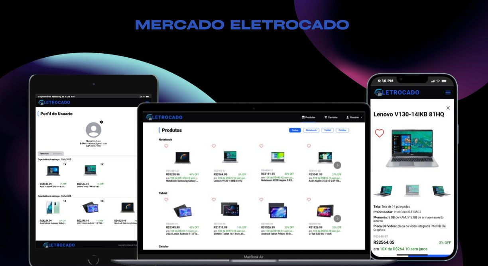

<h1 align='center' >
  💻Mercado Eletrocado
</h1>
<div align='center'>

[Descrição](#descrição)
|
[Iniciar](#iniciar)
|
[Licença](#licença)

</div>

<div align='center'>
  
</div>

<div align='center'>
  
</div>

## Descrição

O projeto é um site de e-commerce de eletrônicos. Tendo como principais funcionalidades...

- carrinho: adicione ou remova produtos do carrinho
- filtro: filtre os dados de acordo com a categoria
- registro e login: registro e login de usuário, feito e registrado nos cookies, no momento sem um banco de dados vinculado.
- checking: os produtos que foram adicionados ao carrinho
- favoritos: adicione ou remova o status de favorito a produtos
- O Permanecimento dos dados do usuário: os dados estão vinculados ao registro do usuário, contudo os dados estão salvos no localStorage do navegador.

Para gerenciar a quantidade massiva de dados, foi usado o Redux toolkit, como principal ferramenta de gerenciamento de estado. por facilitar o gerenciamento e compartilhamento de dados entre os componentes.

No momento o back-end so e para os dados dos produtos, contudo pretendo criar também para os usuários

Se quiser ver o projeto em mais detalhes clique [Mercado Eletrocado](https://mercado-eletrocado-pink.vercel.app/)

## Iniciar

E necessário o [Node.js](https://nodejs.org/pt/download) instalado na máquina e o back-end da aplicação acesse [mercado-eletrocado-api](https://github.com/matheus369k/mercado-eletrocado-api).

Para iniciar o projeto, basta clonar o repositório e instalar as dependências.

```bash
git clone https://github.com/matheus369k/mercado-eletrocado.git
cd mercado-eletrocado
npm install
```

E nesse criar um aquivo env com o nome .env e adicionar as seguintes variáveis de ambiente:

```bash
VITE_DATABASE_URL=http://127.0.0.1:3000/api
VITE_GITHUB_DATABASE_URL=https://raw.githubusercontent.com/matheus369k/mercado-eletrocado/refs/heads/main/db.json
```

Para iniciar o projeto, basta executar o comando:

```bash
npm run dev
```

## Licença

Fora usado a licença [MIT](./LICENSE).
