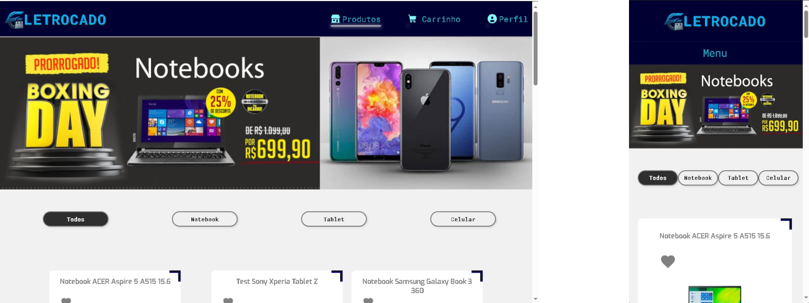

# 💻Mercado Eletrocado

  

## 🎮HandSkills

- ✔️HTML
- ✔️CSS
- ✔️React
- ✔️TypeScript
- ✔️Redux
- ✔️Json-Api

## 📑Descrição

Esse projeto e um Ecommerce que tem como foco a venda de eletrodomesticos, tendo algumas das principais funções presentes em um site desse modelo...

Fora usando uma api-json externa para armazer os dados do projeto, sendo ele referentes as informações dos produtos apresentados no projetos, tendo usado o axios com o verbo http get para coletar os dado referentes ao projeto....

o uso do redux teve como objetivo o gerenciamento do estado do projeto armazenando as informações do usuario como: registro, produtos marcados como favoritos, produtos comprados e etc...

na criação das funções referentes ao cacher de usuario fora utilizado localstorage para salvar dado referentes a produtos comprados, adicionados ao carrinho e etc, fora usando cookies para guardar os dados da conta do usuario...

o projeto fora desenvolvido vizando ser o mais semantico possivel e ser responsive des de computadores ate aparelhos moveis...

## 🏁Conclusão Final

O Desenvolvimento desse projeto foi um grande marco para min, pricipalmente por ser um projeto grande aos meus padrões atuais, fora um projeto em que dei tudo de mim seu desenvolvimento, ao longo de 58 dias para conseguir deixa-lo com esta agora. Ao decorrer desse projeto coloquei em pratica varios conteudos que estudei um pouco antes e durante a crição dele como: redux, cookies, a criação de estrutura de pastas para projetos e TypeScript. Com isso posso afirmar que esse projeto, foi um dos mais grande marcos meus como desenvolvedor web.

## 🥳Agradecimento

Fico feliz a todos que chegar aqui ate aqui, espero que tenha gostado do projeto e se tiver acho algum bug, agradeço se puder me imforma sobre ele.
